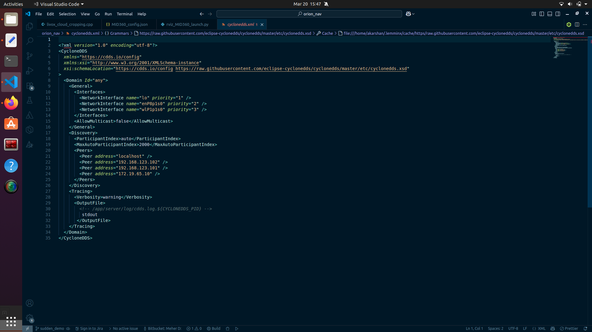

# xTerra Robotics — Orion Sensor Streaming System

## Software Installation Guide

**NVIDIA Jetson Orin Nano Super • ROS2 Humble • Docker • CycloneDDS**

---

## 1. Overview

This guide provides step-by-step instructions for setting up the xTerra Orion streaming environment on the NVIDIA Jetson Orin Nano Super. Following this guide will result in a fully operational Docker-based ROS2 environment capable of streaming Livox MID-360 LiDAR and Intel RealSense D435i camera data across the network.

The installation is structured into the following phases:

- **Phase 1** — Host machine preparation (Docker permissions and udev rules)
- **Phase 2** — Repository cloning and CycloneDDS network configuration
- **Phase 3** — Docker container build and launch
- **Phase 4** — In-container environment configuration
- **Phase 5** — Starting the sensor streaming pipeline

> **NOTE:** Commands in Section 2 must be executed on the Jetson HOST machine — not inside any Docker container. Commands from Section 4 onwards are executed inside the container.

---

## 2. Host Machine Preparation (One Time Process Only)

### 2.1 Docker Group Permissions

By default, running Docker commands requires sudo privileges. The following grants the current user permission to run Docker without sudo.

```bash
sudo usermod -aG docker $USER
newgrp docker
```

The `-aG` flag appends the user to the docker group without removing existing group memberships. The `newgrp` command activates the change immediately in the current session. For a permanent effect across all sessions, log out and back in, or reboot the system.

### 2.2 Intel RealSense udev Rules

Install the official Intel RealSense udev rules on the host:

```bash
sudo wget https://raw.githubusercontent.com/IntelRealSense/librealsense/master/config/99-realsense-libusb.rules -O /etc/udev/rules.d/99-realsense-libusb.rules
sudo udevadm control --reload-rules
sudo udevadm trigger

# Verify the file is in place
ls -la /etc/udev/rules.d/ | grep realsense
```

> ⚠️ **WARNING:** After running the above commands, physically unplug and replug the RealSense USB cable. udev rules only take effect when the device is reconnected.

---

## 3. Repository Setup and Network Configuration

### 3.1 Clone the Repository

Clone the Orion Navigation repository to the recommended workspace location on the Jetson host:

```bash
mkdir -p ~/dev/sensor_streaming
cd ~/dev/sensor_streaming
git clone https://github.com/xterra-robotics/sensor_interfaces.git
cd sensor_interfaces
```

### 3.2 Configure LiDAR Network Interface

The Livox MID-360 LiDAR communicates over Ethernet. Assign the correct IP address to the Ethernet interface before launching the container:

```bash
sudo ip addr add 192.168.1.0/24 dev enP8p1s0
```

Just to confirm Lidar is able to talk to the jetson, you can try pinging the lidar from jetson using

```bash
ping 192.168.1.148
```

### 3.3 Configure CycloneDDS Network (cyclonedds.xml)

CycloneDDS uses an XML configuration file to determine which network interfaces and peer devices to use for ROS2 topic discovery. This file must be updated to match your specific network setup before launching the container.

```bash
nano ~/dev/sensor_streaming/sensor_interfaces/cyclonedds.xml
```

> **NOTE:** If nano is not installed on the system, use vim instead: `vim ~/dev/sensor_streaming/sensor_interfaces/cyclonedds.xml`



Once open, make the following changes:

- **NetworkInterface name** — verify the WiFi interface name matches your Jetson's WiFi adapter. To confirm, run `ifconfig` on the Jetson host outside the container and look for an entry beginning with `wl` (e.g., `wlP1p1s0`).
- **Peer address (laptop IP)** — replace the existing laptop peer entry with your laptop's current WiFi IP address. Run `ifconfig` on the laptop and look under `wlo1` or `wlan0` to find it.

> **NOTE:** The WiFi interface name on the Jetson (e.g., `wlP1p1s0`) must appear in the NetworkInterfaces block. If the name is wrong, ROS2 nodes will not communicate over WiFi. Cross-check with `ifconfig` on the Jetson host before proceeding.

---

## 4. Build and Launch the Docker Container

### 4.1 Run the Setup Script

The `setup_autonomy.sh` script builds the Docker image and starts the container. Passing `true` as an argument triggers a fresh Docker build.

```bash
cd ~/dev/sensor_streaming/sensor_interfaces
./setup_autonomy.sh true
```

The build process may take several minutes on first run as it downloads and compiles all base dependencies.

> **NOTE:** If you encounter any errors during the image build, make sure you have a **stable, high-speed internet connection** and rerun `./setup_autonomy.sh true`.

The script will automatically drop you inside the container shell upon completion. You can confirm you are inside the container by checking the shell prompt — it will show:

```
root@xterra-orin:/home/ros2_ws#
```

---

## 5. In-Container Environment Configuration

All commands in this section are executed inside the Docker container. Confirm you are inside the container before proceeding.

### 5.1 Configure ROS2 Environment Variables

Source the ROS2 workspace and set all required environment variables, including the CycloneDDS URI and ROS domain configuration:

```bash
source set_cyclonedds_ros_custom.sh
```

> **NOTE:** This script sources the ROS2 workspace and sets `RMW_IMPLEMENTATION`, `CYCLONEDDS_URI`, and `ROS_DOMAIN_ID`. It must be run in every new container session before launching any ROS2 commands.

---

## 6. Start Sensor Streaming

With the environment configured, launch the full sensor streaming pipeline:

```bash
./start_streaming.sh
```

This script launches both the Livox MID-360 LiDAR and Intel RealSense D435i camera ROS2 nodes. Once running, all sensor topics are available on the network for any ROS2 client sharing the same CycloneDDS domain and peer configuration.

---

## 7. Topic Discovery

To verify that ROS2 topics are being published:

1. Open a **new terminal** on the Jetson host and navigate to the workspace:

```bash
cd ~/dev/sensor_streaming/sensor_interfaces
```

2. Attach to the running container:

```bash
docker exec -it xterra_autonomy_container bash
```

3. Source the environment:

```bash
source set_cyclonedds_ros_custom.sh
```

4. List available topics:

```bash
ros2 topic list
```

5. Echo a desired topic:

```bash
ros2 topic echo <topic_name>
```

---

\*© 2026 xTerra Robotics.
