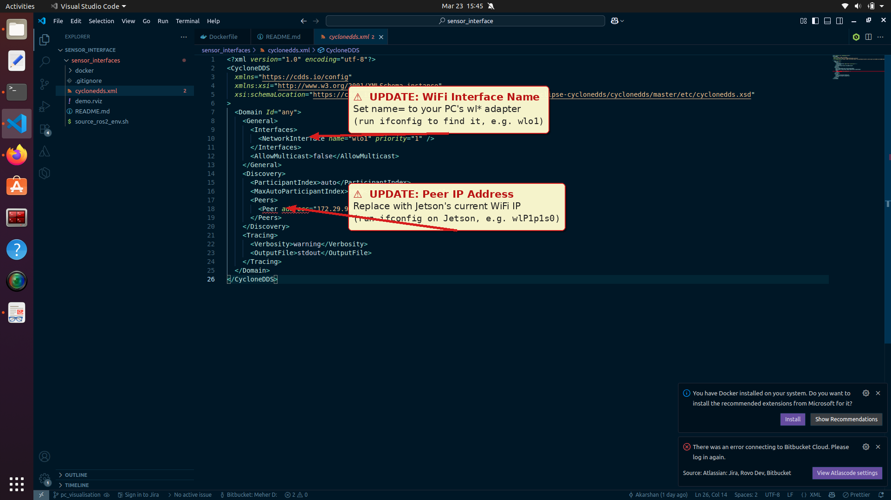

# PC Visualisation Setup

This guide walks you through setting up the PC-side visualisation environment that receives and displays live sensor data (LiDAR + camera) streamed from the xTerra Jetson Orin over ROS2 / CycloneDDS.

---

## ⚠️ Before You Start — Configure `cyclonedds.xml`

> **There are 2 `cyclonedds.xml` files — one on the PC and one on the Jetson.**
> Edit the WiFi interface names on **both** files and update the `<Peer>` IP addresses in **both** files.
>
> - In the **Jetson's** config → the **PC's** WiFi IP goes in `<Peer>`
> - In the **PC's** config → the **Jetson's** WiFi IP goes in `<Peer>`
>
> Both machines must be on the **same WiFi network**.

### What to change in the PC's `cyclonedds.xml`

Open `sensor_interfaces/cyclonedds.xml` in your editor and make the following two changes:

**1. `NetworkInterface` name**
Verify the WiFi interface name matches your PC's WiFi adapter.
To confirm, run `ifconfig` on the PC **outside** the container and look for an entry beginning with `wl` (e.g., `wlo1`).

```xml
<!-- Change this to match your PC's WiFi interface name -->
<NetworkInterface name="wlo1" priority="1" />
```

**2. `Peer` address (Jetson IP)**
Replace the existing peer entry with your **Jetson's** current WiFi IP address.
Run `ifconfig` on the Jetson and look under the interface name starting with `wl` (e.g., `wlP1p1s0`) to find it.

```xml
<!-- Replace with your Jetson's actual WiFi IP -->
<Peer address="<JETSON_WIFI_IP>" />
```

The screenshot below shows the exact two lines to edit (highlighted with red arrows):



---

## PC Visualisation Setup

### Step 1 — Build the Docker image

```bash
cd docker
docker build -t fast-lio-ros2:latest .
```

### Step 2 — Enter the container

```bash
./enter_container.sh
```

### Step 3 — Source the ROS2 environment

```bash
source source_ros2_env.sh
```

### Step 4 — Verify environment variables are set correctly

After sourcing, confirm that all required ROS2 / CycloneDDS variables are exported:

```bash
echo $CYCLONEDDS_URI
echo $RMW_IMPLEMENTATION
echo $ROS_DOMAIN_ID
```

Expected output:

```
/path/to/cyclonedds.xml        # should point to your cyclonedds.xml
rmw_cyclonedds_cpp              # must be set to CycloneDDS
0                               # must be 0
```

> If any of these are empty, re-run `source source_ros2_env.sh` and check the script for missing exports.

### Step 5 — Launch RViz2

```bash
rviz2 -d demo.rviz
```

---
